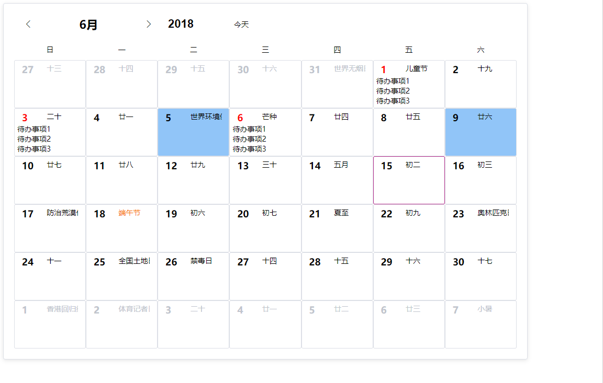

# ve-calendar

> 这是一个基于vue 2.0的日历组件
> 
<p align="center">
   <a href="https://www.npmjs.com/package/ve-calendar"></a>
   <a href="https://www.npmjs.com/package/ve-calendar"></a>
 </p>
 

[English](./README.MD)

# 目前功能:
>1、显示2050年以前的农历、节气、节日
>
>2、可指定最大选中日期数量
>
>3、可用插槽自定义日期数字、农历、事件区域


## 快速开始

### 第一步:
``` sh
npm install ve-calendar --save
```
### 第二步，在你的vue页面里
``` js
import veCalendar from "ve-calendar";

// in your vue <script>
export default {
    components: {
        veCalendar
    }
}
```

### 第三步，加载模板:
``` html
<veCalendar v-model="selectDateList"></veCalendar>

```


## props参数
| 参数名称      | 类型    | 默认值     | 说明                                  |
| ------------- | ------- | ---------- | ------------------------------------- |
| value         | array   | 无         | v-model绑定值，是当前选中日期列表     |
| activate-date | object  | 今天的年月 | 包含两个值year当前年份，month当前月份 |
| most-choice   | number  | 0          | 最多选择日期数量,0无限                |
| cross-month   | boolean | false      | 是否允许跨月选择日期                  |


## 事件
| 名字             | 参数               | 说明                                                       |
| ---------------- | ------------------ | ---------------------------------------------------------- |
| refresh-calendar | 无                 | 当切换日历时触发/改变激活年月                              |
| change           | selectedDate/array | 选中日期发生改变时触发，参数是当前选中的日期列表（字符串） |


## 插槽
| 名字       | 参数 | 说明                                                    |
| ---------- | ---- | ------------------------------------------------------- |
| day-number | day  | 用来替换默认的左上角数字，day就是当天的数据对象         |
| day-lunar  | day  | 用来替换右上角的农历、节日、节气，day就是当天的数据对象 |
| day-event  | day  | 用来显示待办事项之类的功能，day就是当天的数据对象       |


## demo
``` html
<ve-calendar v-model="selected" @change="refreshC" :off-days="test" :cross-month="false"  >
  <div slot="day-number" slot-scope="{day}">
    <span :style="day.sMonth===month&&test.indexOf(day.sDay)>=0?'color:red;':''">{{day.sDay}</span>
  </div>
  <div slot="day-event" slot-scope="{day,click}">
    <div v-if="day.sMonth===month&&test.indexOf(day.sDay)>=0">
      <div v-for="item in 5" :key="item" @click="click(item)">待办事项{{item}}</div>
    </div>
  </div>
</ve-calendar>
```

## 预览



## License

[MIT]
